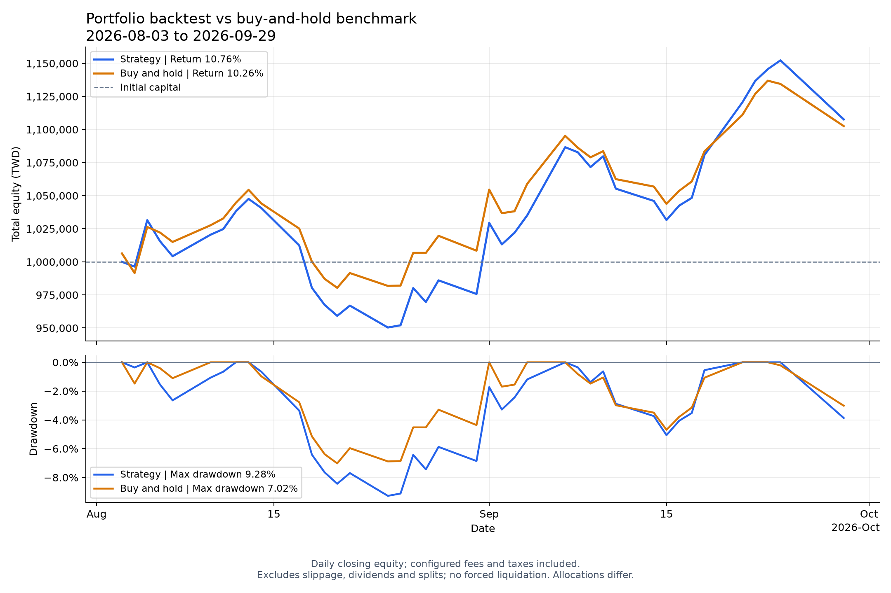

# 台股資料處理與回測工具 v1

以台股公開資料為案例，實作從 API 資料擷取、SQLite 儲存、規則排名到歷史模擬與報表輸出的 Python 工具。
支援批次下載與斷點接續，透過資料品質檢查、自動化測試及輸入快照保存，提升處理流程的可靠性與結果可追查性。

**技術：Python 3.12 · SQLite · HTTP API 串接 · Git · Matplotlib · Flask**

[操作展示](docs/DEMO.md) · [測試程式](tests/) · [設定檔](config.toml)

## 工程設計與已完成功能

| 能力 | 實作方式 |
|---|---|
| 外部資料整合 | 擷取證交所月行情與上市普通股名單，轉換日期、價格與成交量格式 |
| 批次與故障處理 | 請求重試、逐檔保存 JSON 進度；`--resume` 接續未完成及失敗項目 |
| 資料儲存 | SQLite 以股票代號與日期識別行情，重複下載更新既有紀錄；分析使用唯讀連線 |
| 資料品質 | 保留來源缺值、回報資料不足與過期行情；不把未知缺漏直接當成停牌 |
| 可設定的分析 | TOML 設定搭配 CLI 覆寫，支援規則篩選與多因子相對排名 |
| 時間與狀態管理 | 只用當時可取得的資料產生訊號，下一行情日模擬成交，管理共用現金與持股 |
| 成本與配置 | 固定股數／固定預算、費稅與固定比例滑價；以 Decimal 處理價格和金額 |
| 結果追查 | 保存設定、輸入行情快照、交易與每日資產，匯出 JSON／CSV 及比較圖 |
| 自動化驗證 | 單元、整合及回歸測試涵蓋缺值、時間窗口、成本、停牌與報表流程 |

## 功能展示

- **批次排名**：讀取股票名單與本機行情，產生候選排名，並列出無法評估的原因。
- **歷史回測**：模擬交易、資金與成本，提供買進持有基準比較，匯出報表與圖表。

下圖為範例資料產生的回測結果；實際輸出取決於資料、日期與設定。



範例設定、數據與解讀見 [DEMO](docs/DEMO.md#展示數據與限制)。

## 架構與資料流

```text
外部 API → 解析與驗證 → SQLite／名單 JSON
                           ↓
                    截至分析日的排名
                           ↓
                    歷史交易與資金模擬
                           ↓
                   JSON／CSV 報表 → 圖表
```

| 路徑 | 責任 |
|---|---|
| `src/tw_stock_backtest/cli/` | 參數解析與流程串接，目前也包含下載流程 |
| `src/tw_stock_backtest/data/` | 資料解析、儲存、名單與市場事件；屬於原始碼 |
| `src/tw_stock_backtest/analysis/` | 指標、篩選、排名與後續報酬評估 |
| `src/tw_stock_backtest/backtesting/` | 交易、資金配置、成本、基準與績效 |
| `src/tw_stock_backtest/reporting.py`、`plotting.py` | 報表匯出與繪圖 |
| `tests/` | 可隨專案執行的自動化測試 |
| `config.toml` | 資料庫位置與計算、模擬參數 |
| 根目錄 `data/`、`reports/` | 本機資料與完整報表，不納入 Git |
| `docs/DEMO.md` | 操作順序、新環境資料準備與結果說明 |
| `experiments/` | 後續跨期間驗證的設定與安排 |

## 快速開始

開發環境為 WSL2 Ubuntu 24.04，要求 Python 3.12 以上，採 `src` 套件配置。
先在終端機切換至 clone 後的專案根目錄，再執行：

```bash
pwd
python3 --version
python3 -m venv .venv
.venv/bin/python -m pip install -e .
.venv/bin/python -c 'import sys; print(sys.executable); print(sys.version)'
```

Ubuntu 若缺少 venv 支援，先安裝 `python3-venv`。已有 `.venv` 不需重建。
editable 安裝讓原始碼修改直接生效，依賴由 pyproject.toml 安裝。

**新環境沒有行情資料是正常情況。** 先依 [三檔資料準備步驟](docs/DEMO.md#新環境沒有-data-時) 下載暖機與展示期間行情；已有資料可直接執行：

```bash
# 三檔排名
.venv/bin/python -m tw_stock_backtest.cli.screen_factors --as-of 2026-09-29 --stocks 2330 2317 2454 --top 3

```

設定集中在 config.toml；CLI 支援的覆寫參數優先，不修改原設定。
資料庫相對路徑以設定檔所在目錄為基準。完整操作見 [DEMO](docs/DEMO.md)。

## 自動化研究流程

`run_research` 串接增量行情更新、同日因子排名與 JSON／CSV 保存。每次執行產生獨立報表，失敗或排除原因也會記錄。

```bash
# 使用既有行情，不下載；本機可直接驗證
.venv/bin/python -m tw_stock_backtest.cli.run_research --skip-download --as-of 2026-09-29 --output-dir /tmp/tw-stock-research

# 依設定檔小型股票池增量更新，再選最新可用日期排名
.venv/bin/python -m tw_stock_backtest.cli.run_research
```

- **測試 CI**：push／PR／手動觸發，在 Python 3.12 乾淨環境跑離線測試。
- **研究 workflow**：手動或定時連線更新行情，保存報表 artifacts；定時執行預設關閉。
- 行情 cache 遺失時，僅初始化最近 90 個日曆日，不重新下載全部歷史。

參數、resume、退出碼及 Actions 設定見 [自動化研究操作](docs/DEMO.md#自動化研究流程)。

## 本機研究工作台

```bash
.venv/bin/python -m pip install -e .
.venv/bin/python -m tw_stock_backtest.cli.serve_workbench
```

開啟 `http://127.0.0.1:8765`，瀏覽既有報表、排入研究／回測工作、比較排名與查看基準圖表。
預設只讀本機行情。研究報告包含候選股、因子加權貢獻、可比較前期的排名變化及資料限制；網頁與 Gmail 共用摘要。
每次工作產生 HTML／純文字郵件預覽與排名 CSV；只有 CLI 明確 `--send` 才寄信。
[操作、輸出位置與自行寄信設定](docs/DEMO.md#本機網頁工作台與-gmail)。

## 策略庫與比較

可保存、複製 JSON 策略，使用 RSI、MACD、突破、均線與量比條件；因子先對原母體評分，再決定候選資格。
每次執行保存策略快照與 SHA-256，策略比較共用行情、資金、成本及買進持有基準。
在工作台點選「管理策略庫」，或依 [策略操作與指標定義](docs/DEMO.md#策略庫技術指標與比較) 使用 CLI。
支援明確指定多個期間，獨立重置資金、記錄用途與資料不足原因，保存各子回測及比較摘要。
[跨期間操作與驗收](docs/DEMO.md#跨期間策略驗收與評估)。示例僅展示軟體功能，不代表已驗證有效。

## 測試與驗證

```bash
.venv/bin/python -m unittest discover -s tests -v
```

2026-10-05 [安全修正的 GitHub CI](https://github.com/kevinhuang-11/tw-stock-backtest/actions/runs/37274585944)：**310 個測試通過**。
2026-10-06 策略庫與跨期間階段本機及 [策略與跨期間 GitHub CI](https://github.com/kevinhuang-11/tw-stock-backtest/actions/runs/37401510494) 均 **326 項測試通過**（提交 `2f2290b`，乾淨 runner 安裝套件後執行）。
三檔研究流程亦完成無 cache 初始化及 cache 還原後的增量更新；[驗收紀錄](docs/DEMO.md#github-遠端驗收2026-10-01)。
測試使用暫存資料與模擬輸入，不需要先下載全市場行情。

可從這些測試了解設計：

- [因子窗口](tests/test_factors.py)：窗口外舊缺值不影響計算，窗口內缺值被拒絕，未來資料不改變當日結果。
- [下載接續](tests/test_download_universe.py)：進度保存、工作參數檢查與待下載項目選取。
- [多股票回測](tests/test_portfolio_backtest.py)：共用現金、下一日成交、配置與滑價。
- [端到端流程](tests/test_end_to_end.py)：回測、報表匯出與繪圖串接。

## 範圍與限制

v1 聚焦資料處理與交易模擬，提供單人本機工作台，不包含 ML、券商下單或公開網頁服務。
目前使用上市名單及簡化成交模型，尚未處理股利、拆股與獨立交易日曆。
測試驗證程式行為，策略有效性仍需跨期間與樣本外驗證。


